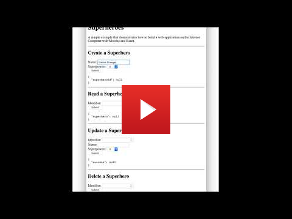

## Superheroes

[](https://github.com/enzoh/superheroes/actions?query=workflow%3Abuild)

A simple example that demonstrates how to build a [CRUD](https://en.wikipedia.org/wiki/Create,_read,_update_and_delete) application on the [Internet Computer](https://dfinity.org) using [Motoko](https://sdk.dfinity.org/docs/language-guide/motoko.html) and [React](https://reactjs.org). 

### Prerequisites

- [DFINITY SDK](https://sdk.dfinity.org/docs/download.html) v0.6.4
- [Node.js](https://nodejs.org/download/release/latest-v12.x) v12.x
- [Vessel](https://github.com/kritzcreek/vessel/releases/tag/v0.4.1) v0.4.1 (Optional)

### Demo

Start a local internet computer.

```
dfx start
```

Execute the following commands in another tab.

```
dfx canister create --all
dfx build
dfx canister install --all
open "http://127.0.0.1:8000/?canisterId=$(dfx canister id www)"
```

Observe the CRUD application running in your web browser.

[](http://www.youtube.com/watch?v=ioCW-9C8feE)
